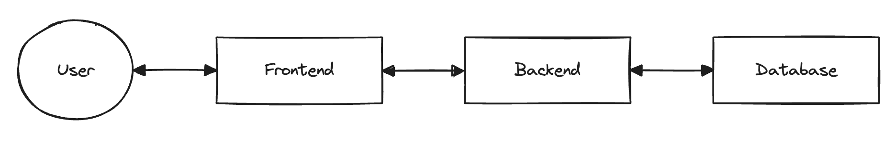

# skaff-rag-accelerator


This is a starter kit to deploy a modularizable RAG locally or on the cloud (or across multiple clouds)

## Features

- A configurable RAG setup based around Langchain ([Check out the configuration cookbook here](https://artefactory.github.io/skaff-rag-accelerator/cookbook/))
- `RAG` and `RagConfig` python classes that manage components (vector store, llm, retreiver, ...)
- A REST API based on Langserve + FastAPI to provide easy access to the RAG as a web backend
- Optional API plugins for secure user authentication, session management, ...
- `Chain links` primitive that facilitates chain building and allows documentation generation
- A demo Streamlit to serve as a basic working frontend
- `Dockerfiles` and `docker-compose` to make deployments easier and more flexible
- A document loader for the RAG


## Quickstart

This quickstart will guide you through the steps to serve a RAG fully locally. You will run the API backend and frontend on your machine, which should allow you to run your first queries against the RAG.

For this exemple, we will be using the `tinyllama` LLM, the `BAAI/bge-base-en-v1.5` embedding model, and Chroma for the vector store. This allows this setup to be fully local, and independent of any external API (and thus, free). However, the relevance of answers will not be impressive.

Duration: ~15 minutes.

### Pre-requisites

- Ollama, to serve the LLM locally ([Download and install](https://ollama.com/))
- A few GB of disk space to host the models
- Tested with python 3.11 (may work with other versions)

### Run using docker compose

If you have docker installed and running you can run the whole RAG app using it. [Otherwise, skip to the "Run directly" section](#run-directly)

Start the LLM server:
```shell
ollama run tinyllama
```

Start the service:
```shell
docker compose up -d
```

Make sure both the front and back are alive:
```shell
docker ps
```
You should see two containers with status `Up X minutes`.

Go to http://localhost:9000/ to query your RAG.

### Run directly

Start the LLM server:
```shell
ollama run tinyllama
```

In a fresh env:
```shell
pip install -r requirements-dev.txt
```

You will need to set some env vars, either in a .env file at the project root, or just by exporting them like so:
```shell
export PYTHONPATH=.
export ADMIN_MODE=1
```

Start the backend server locally:
```shell
python -m uvicorn backend.main:app
```

Start the frontend demo
```shell
python -m streamlit run frontend/front.py
```

### Querying and loading the RAG

You should then be able to login and chat to the bot:


Right now the RAG does not have any document loaded, let's add a sample:
```shell
python data_sample/add_data_sample_to_rag.py
```

The RAG now has access to the information from your loaded documents:


## Documentation

To deep dive into under the hood, take a look at the documentation

[On github pages](https://artefactory.github.io/skaff-rag-accelerator/)

Or serve them locally:
```shell
mkdocs serve
```
Then go to http://localhost:8000/


## Architecture

The whole goal of this repo is to decouple the "computing and LLM querying" part from the "rendering a user interface" part. We do this with a typical 3-tier architecture.



- The [frontend](frontend.md) is the end user facing part. It reches out to the backend **ONLY** through the REST API. We provide a frontend demo here for convenience, but ultimately it could live in a completely different repo, and be written in a completely different language.
- The [backend](backend/backend.md) provides a REST API to abstract RAG functionalities. It handles calls to LLMs, tracks conversations and users, handles the state management using a db, and much more. To get the gist of the backend, look at the of the API: http://0.0.0.0:8000/docs. It can be extended by plugins.
- The [database](database.md) is only accessed by the backend and persists the state of the RAG application. The same plugins that extend the functionalities of the backed, can extend the data model of the DB.

The structure of the repo mirrors this architecture.
