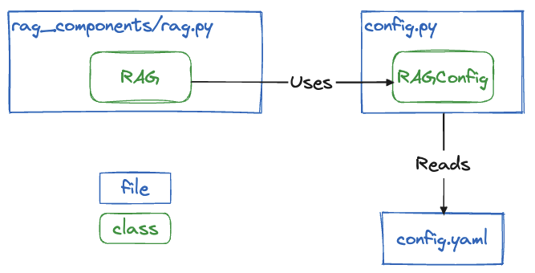

<div align="center"> 

# skaff-rag-accelerator 

</div>

This is a starter kit to deploy a modularizable RAG locally or on the cloud (or across multiple clouds)

## Features

- A configurable RAG setup based around Langchain
- `RAG` and `RagConfig` python classes to help you set things up
- A REST API based on FastAPI to provide easy access to the RAG as a web backend
- A demo Streamlit to serve as a basic working frontend (not production grade)
- A document loader for the RAG
- User authentication (unsecure for now, but usable for conversation history)
- User feedback collection
- Streamed responses

## Quickstart

In a fresh env:
```shell
pip install -r requirements.txt
```

You will need to set some env vars, either in a .env file at the project root, or just by exporting them like so:
```shell
export OPENAI_API_KEY="xxx"  # API key used to query the LLM
export EMBEDDING_API_KEY="xxx"  # API key used to query the embedding model
export DATABASE_URL="sqlite:///$(pwd)/database/db.sqlite3"  # For local developement only. You will need a real, cloud-based SQL database URL for prod.
```

Start the backend server locally
```shell
python backend/main.py
```

Start the frontend demo
```shell
streamlit run frontend/app.py
```

You should than be able to login and chat to the bot:


## Loading documents

The easiest but least flexible way to load documents to your RAG is to use the `RAG.load_file` method. It will semi-intellignetly try to pick the best Langchain loader and parameters for your file.

Create `backend/load_my_docs.py`:
```python
from pathlib import Path

from backend.rag_components.rag import RAG


data_directory = Path("data")

config_directory = Path("backend/config.yaml")
rag = RAG(config_directory)

for file in data_directory.iterdir():
    if file.is_file():
        rag.load_file(file)
```

If you want more flexibility, you can use the `rag.load_documents` method which expects a list of `langchain.docstore.document` objects. 

**TODO: example**

#### Document indexing

The document loader maintains an index of the loaded documents. You can change it in the configuration of your RAG at `vector_store.insertion_mode` to `None`, `incremental`, or `full`. 

[Details of what that means here.](https://python.langchain.com/docs/modules/data_connection/indexing)

## Configuring the RAG

### The `RAG` object

It provides a unique interface to the RAG's functionalities. 

Out of the box, A RAG object is created from your configuration and used by the `/chat/{chat_id}/user_message` endpoint in [`backend/main.py`](backend/main.py)

The RAG class initializes key components (language model, embeddings, vector store), and generates responses to user messages using an answer chain.

It also manages document loading and indexing based on configuration settings.


Using the `RAG` class directly:
```python
from pathlib import Path
from backend.rag_components.rag import RAG
from backend.model import Message

config_directory = Path("backend/config.yaml")
rag = RAG(config_directory)

message = Message(
    id="123",
    timestamp="2021-06-01T12:00:00",
    chat_id="123",
    sender="user",
    content="Hello, how are you?",
)
response = rag.generate_response(message)
print(response)
```

[Go to the code.](backend/rag_components/rag.py)

### Managing the configuration (`RAGConfig`)

The overall config management works like this:


This means the best way to configure your RAG deployment is to modify the config.yaml file.

This file is then loaded to instanciate a `RAGConfig` object which is used by the `RAG` class.

In the default configuration template ([`backend/config.yaml`](backend/config.yaml)) you will find this:
```yaml
# This is the LLM configuration (&LLMConfig is a yaml anchor to reference this block further down in the conf file)
LLMConfig: &LLMConfig

  # By default we're using a GPT model deployed on Azure. You should be able to change this to any langchain BaseChatModel here: https://github.com/langchain-ai/langchain/blob/master/libs/community/langchain_community/chat_models/__init__.py
  source: "AzureChatOpenAI" 
  
  # This is a key-value map of the parameters that will be passed to the langchain chat model object when it's created. Looking at the AzureChatOpenAI source code (https://github.com/langchain-ai/langchain/blob/master/libs/community/langchain_community/chat_models/azure_openai.py), we input the following params:
  source_config:
    openai_api_type: "azure"
    openai_api_key: {{ OPENAI_API_KEY }}
    openai_api_base: "https://poc-genai-gpt4.openai.azure.com/"
    openai_api_version: "2023-07-01-preview"
    deployment_name: "gpt4v"

  # While the params in source_config are specific to each model, temperature is implemented by all BaseChatModel classes in langchain.
  temperature: 0.1

# ... Rest of the config ...
```

Let's say we want to use a Vertex LLM instead. [Looking at the source code of this model in langchain](https://github.com/langchain-ai/langchain/blob/master/libs/community/langchain_community/chat_models/vertexai.py#L206C7-L206C19), we find this: 

```python
class ChatVertexAI(_VertexAICommon, BaseChatModel):
    """`Vertex AI` Chat large language models API."""

    model_name: str = "chat-bison"
    "Underlying model name."
    examples: Optional[List[BaseMessage]] = None
```

Updated `config.yaml` could look like this:
```yaml
LLMConfig: &LLMConfig
  source: "ChatVertexAI"
  source_config:
    model_name: gemini-pro
  temperature: 0.1
```


## Architecture

### The `frontend`, the `backend`, and the `database`

The whole goal of this repo is to decouple the "computing and LLM querying" part from the "rendering a user interface" part. We do this with a typical 3-tier architecture.


- The [frontend](frontend) is the end user facing part. It reches out to the backend **ONLY** through the REST API. We provide a frontend demo here for convenience, but ultimately it could live in a completely different repo, and be written in a completely different language.
- The [backend](backend) provides a REST API to abstract RAG functionalities. It handles calls to LLMs, tracks conversations and users, handles the state management using a db, and much more. To get the gist of the backend, look at the of the API: http://0.0.0.0:8000/docs
- The [database](database) is only accessed by the backend and persists the state of the RAG application. [Explore the data model here.](https://dbdiagram.io/d/RAGAAS-63dbdcc6296d97641d7e07c8)


## Going further

### Extending the configuration

As you tune this starter kit to your needs, you may need to add specific configuration that your RAG will use. 

For example, let's say you want to add the `foo` configuration parameter to your vector store configuration.

First, add it to `config.py` in the part relavant to the vector store:

```python
# ...

@dataclass
class VectorStoreConfig:
    # ... rest of the VectorStoreConfig ...

    foo: str = "bar"  # We add foo param, of type str, with the default value "bar"

# ...
```

This parameter will now be available in your `RAG` object configuration.

```python
from pathlib import Path
from backend.rag_components.rag import RAG

config_directory = Path("backend/config.yaml")
rag = RAG(config_directory)

print(rag.config.vector_store.foo)
# > bar
```

if you want to override its default value. You can do that in your `config.yaml`:
```yaml
VectorStoreConfig: &VectorStoreConfig
  # ... rest of the VectorStoreConfig ...
  foo: baz
```

```python
print(rag.config.vector_store.foo)
# > baz
```

### Using `RagConfig` directly

TODO: Add usage example here