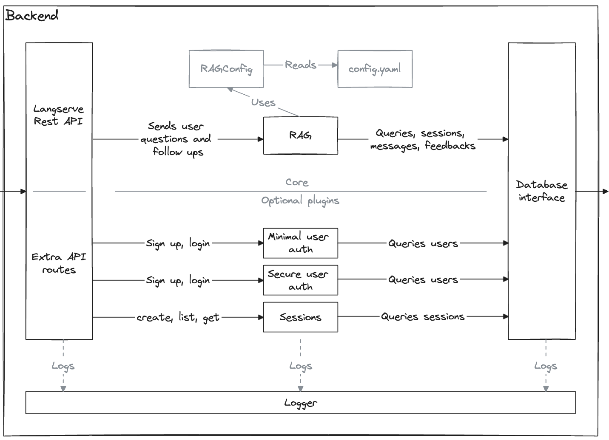
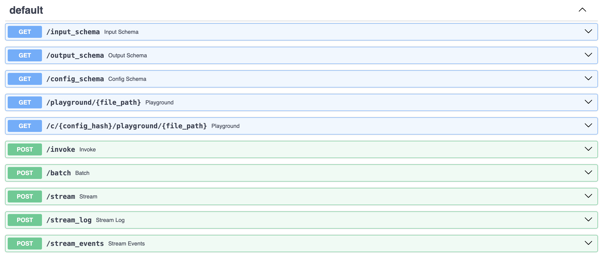
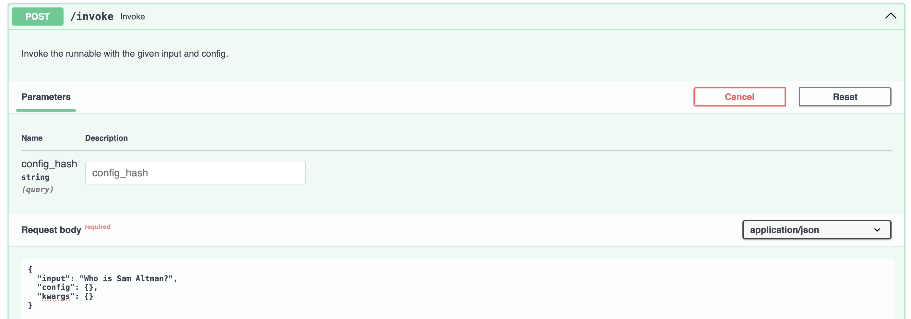
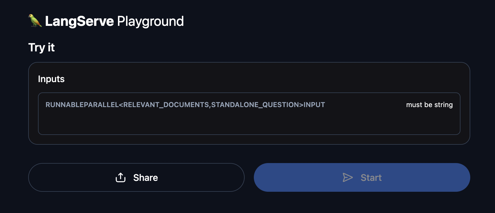

The backend provides a REST API to abstract RAG functionalities. The core embarks just enough to query your indexed documents.

More advanced features (authentication, user sessions, ...) can be enabled through [plugins](plugins/plugins.md).

### Architecture



Start the backend server locally:
```shell
python -m uvicorn backend.main:app
```
> INFO:     Application startup complete.

> INFO:     Uvicorn running on http://127.0.0.1:8000 (Press CTRL+C to quit)


### Base RAG

The base RAG-as-a-service API is defined at `backend/main.py`:
```python
rag = RAG(config=Path(__file__).parent / "config.yaml")
chain = rag.get_chain()

app = FastAPI(
    title="RAG Accelerator",
    description="A RAG-based question answering API",
)

add_routes(app, chain)
```
The basic core RAG allows you to load and ask questions about documents. `add_routes` comes straight from Langserve and sets up the basing API routes for chain serving. Our plugins will be added similarly.

By going to the API documentation (http://0.0.0.0:8000/docs if serving locally) you will have these routes. You can query your RAG directly from here using the `/invoke` endpoint if you want to.





You can also query your RAG using the Langserve playground at http://0.0.0.0:8000/playground. It should look like this:


