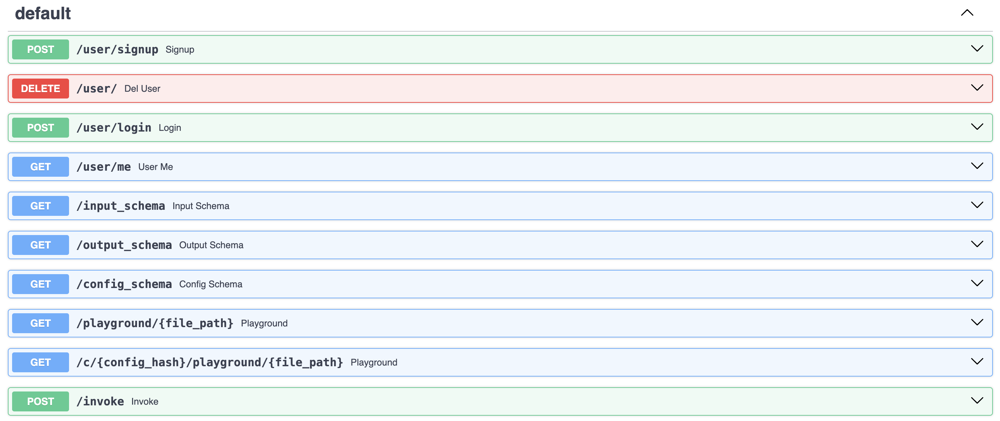

We provide two plugins for user management: secure, and insecure authentication.

- The secure authentication is the recommended approach when the API is intended to be deployed on a public endpoint.
- The insecure plugin is a little simpler and can be used in testing or when users having access to other people's sessions is not an issue.

!!! danger "Do not use the insecure auth plugin for deployments exposed to the internet"
    This would allow anyone to query your LLM and spend your tokens.

```python
from backend.api_plugins import insecure_authentication_routes
```
```python
rag = RAG(config=Path(__file__).parent / "config.yaml")
chain = rag.get_chain()

app = FastAPI(
    title="RAG Accelerator",
    description="A RAG-based question answering API",
)

auth = insecure_authentication_routes(app)
add_routes(app, chain, dependencies=[auth])
```

Similarly than for the sesions before, we add the routes that will allow the users to sign up and login using the `insecure_authentication_routes` plugin.


The tricky part is that we need all the existing endpoints to covered by the authentication. To do this we inject `auth` as a dependency of Langchain's `add_routes`.

We have new user management routes:


And now every other route expects an email as a parameter which can be used to retrieve previous chats for examples.

