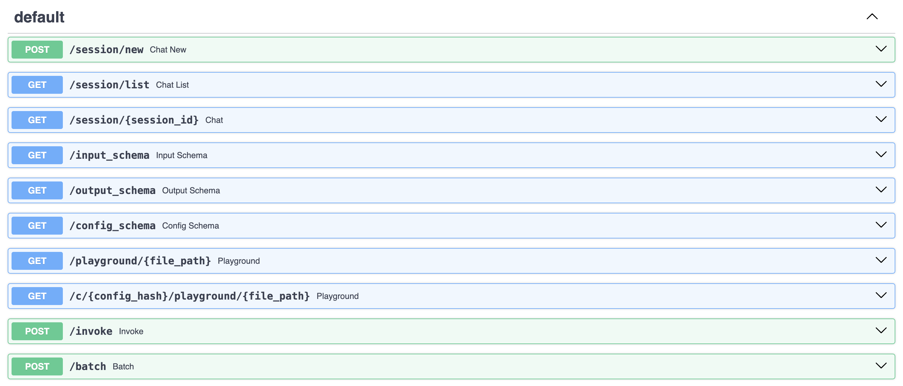

### Conversational RAG

Let's say you want to have sessions support for the RAG to be able hold a conversation rather than just answer standalone questions:
```python
from backend.api_plugins import session_routes
```
```python
rag = RAG(config=Path(__file__).parent / "config.yaml")
chain = rag.get_chain(memory=True)

app = FastAPI(
    title="RAG Accelerator",
    description="A RAG-based question answering API",
)

add_routes(app, chain)
session_routes(app)
```

We have added two things here:

- We set `memory=True` in `RAG.get_chain`. That will create a slightly different chain than before. This new chain adds memory handling capabilities to our RAG.
- We imported and called the `session_routes` plugin.

We will now have new session management routes available in the API:


And also, the playground now takes a `SESSION ID` configuration: 

