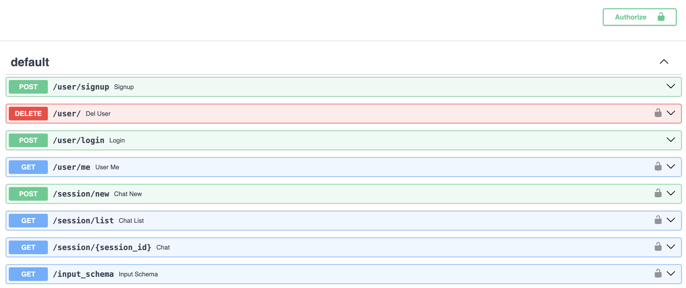

Now we bring it all together: sessions, and secure authentication. By combining the sessions plugin and the secure authentication plugin, we can have user-specific profiles which are completely distinct from one another.

```python
from backend.api_plugins import session_routes, authentication_routes
```
```python
rag = RAG(config=Path(__file__).parent / "config.yaml")
chain = rag.get_chain(memory=True)

app = FastAPI(
    title="RAG Accelerator",
    description="A RAG-based question answering API",
)

auth = authentication_routes(app)
session_routes(app, authentication=auth)
add_routes(app, chain, dependencies=[auth])
```

Here our authentication plugin is injected in both the sessions and core routes. With this setup, all calls will need to be authenticated with a bearer token that the API provides after a sucessful login.

Notice the locks pictograms on every route. These indicate the routes are protected by our authentication scheme. You can still query your RAG using this interface by first login through the `Authorize` button. The Langserve playground does not support this however, and is not usable anymore.

