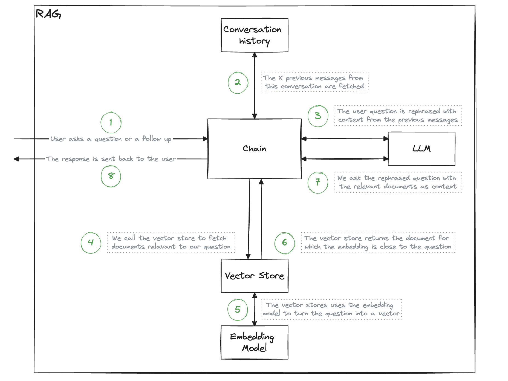

# skaff-rag-accelerator

This is a starter kit to deploy a modularizable RAG locally or on the cloud (or across multiple clouds)

## Features

- A configurable RAG setup based around Langchain
- `RAG` and `RagConfig` python classes to help you set things up
- A REST API based on FastAPI to provide easy access to the RAG as a web backend
- A demo Streamlit to serve as a basic working frontend (not production grade)
- A document loader for the RAG
- User authentication (unsecure for now, but usable for conversation history)
- User feedback collection
- Streamed responses

## Quickstart

In a fresh env:
```shell
pip install -r requirements.txt
```

You will need to set some env vars, either in a .env file at the project root, or just by exporting them like so:
```shell
export OPENAI_API_KEY="xxx"  # API key used to query the LLM
export EMBEDDING_API_KEY="xxx"  # API key used to query the embedding model
export DATABASE_URL="sqlite:///$(pwd)/database/db.sqlite3"  # For local developement only. You will need a real, cloud-based SQL database URL for prod.
```

Start the backend server locally
```shell
uvicorn backend.main:app
```

Start the frontend demo
```shell
streamlit run frontend/app.py
```

You should then be able to login and chat to the bot:


## Architecture

### The `frontend`, the `backend`, and the `database`

The whole goal of this repo is to decouple the "computing and LLM querying" part from the "rendering a user interface" part. We do this with a typical 3-tier architecture.


- The [frontend](frontend) is the end user facing part. It reches out to the backend **ONLY** through the REST API. We provide a frontend demo here for convenience, but ultimately it could live in a completely different repo, and be written in a completely different language.
- The [backend](backend) provides a REST API to abstract RAG functionalities. It handles calls to LLMs, tracks conversations and users, handles the state management using a db, and much more. To get the gist of the backend, look at the of the API: http://0.0.0.0:8000/docs
- The [database](database) is only accessed by the backend and persists the state of the RAG application. [Explore the data model here.](https://dbdiagram.io/d/RAGAAS-63dbdcc6296d97641d7e07c8)

The structure of the repo mirrors this architecture.

### The RAG



In the `backend` folder of the repository, you will find a `rag_components` directory that implements this architecture.
