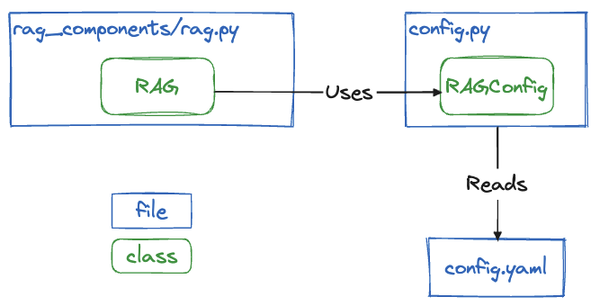

## Architecture

The overall config management works like this:


This means the best way to configure your RAG deployment is to modify the `config.yaml` file. You can find configuration examples in the [Config Cookbook](cookbook.md)

This file is then loaded to instanciate a `RAGConfig` object which is used by the `RAG` class.

## Changing the configuration

In the default configuration template ([`backend/config.yaml`](backend/config.yaml)) you will find this:

```yaml
# This is the LLM configuration (&LLMConfig is a yaml anchor to reference this block further down in the conf file)
LLMConfig: &LLMConfig

# By default we're using a GPT model deployed on Azure.
# You should be able to use any langchain BaseChatModel listed here:
# https://github.com/langchain-ai/langchain/blob/master/libs/community/langchain_community/chat_models/__init__.py
source: AzureChatOpenAI"

# This is a key-value map of the parameters that will be passed to the
# langchain chat model object when it's created.
# Looking at the AzureChatOpenAI source code (https://github.com/langchain-ai/langchain/blob/master/libs/community/langchain_community/chat_models/azure_openai.py),
# we input the following params:
source_config:
    openai_api_type: azure
    openai_api_key: {{ OPENAI_API_KEY }}
    openai_api_base: https://poc-genai-gpt4.openai.azure.com/
    openai_api_version: 2023-07-01-preview
    deployment_name: gpt4v

# While the params in source_config are specific to each model,
# temperature is implemented by all BaseChatModel classes in langchain.
# We input it outside the source_config block
temperature: 0.1

# ... Rest of the config ...
```

Let's say you want to use a gemini-pro on Vertex AI instead. [This is the source code of this model in langchain](https://github.com/langchain-ai/langchain/blob/master/libs/community/langchain_community/chat_models/vertexai.py#L206C7-L206C19):

```python
class ChatVertexAI(_VertexAICommon, BaseChatModel):
    """`Vertex AI` Chat large language models API."""

    model_name: str = "chat-bison"
    "Underlying model name."
    examples: Optional[List[BaseMessage]] = None

    ...
```

The  `config.yaml` could look like this:
```yaml
LLMConfig: &LLMConfig
  source: ChatVertexAI
  source_config:
    model_name: gemini-pro
  temperature: 0.1
```

Now, the next time you start the API, it will call gemini-pro instead of openAI.

## Extending the configuration

As you tune this starter kit to your needs, you may need to add specific configuration that your RAG will use.

For example, let's say you want to add the `foo` configuration parameter to your vector store configuration.

First, add it to `config.py` in the part relavant to the vector store:

```python
# ...

@dataclass
class VectorStoreConfig:
    # ... rest of the VectorStoreConfig ...

    foo: str = "bar"  # We add foo param, of type str, with the default value "bar"

# ...
```

This parameter will now be available in your `RAG` object configuration.

```python
from pathlib import Path
from backend.rag_components.rag import RAG

config_directory = Path("backend/config.yaml")
rag = RAG(config_directory)

print(rag.config.vector_store.foo)
# > bar
```

if you want to override its default value. You can do that in your `config.yaml`:
```yaml
VectorStoreConfig: &VectorStoreConfig
  # ... rest of the VectorStoreConfig ...
  foo: baz
```

```python
print(rag.config.vector_store.foo)
# > baz
```
